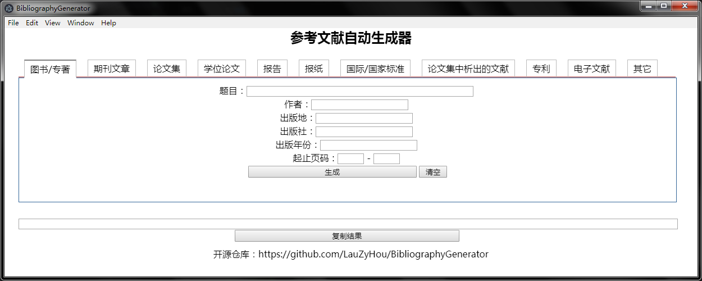

# BibliographyGenerator
参考文献自动生成器，基于Electron的桌面应用。

## 项目进度
5%

## 运行展示

## 参考
[打造第一个Electron app](https://electronjs.org/docs/tutorial/first-app)

[用html+css+js实现选项卡切换效果](https://www.cnblogs.com/jeacy/p/6336772.html)

[参考文献自动生成器](http://www.lunwenstudy.com/ckwx/)